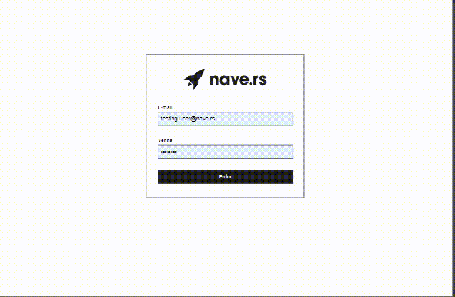

<h1>Navedex<h1/>

<h2>Rotas</h2>

<ul>
    <li>"/login ou / => tela de login"</li>
    <li>/navers/index => página principal</li>
    <li>/navers/update/:id => editar naver</li>
    <li>/navers/create => criar novo naver</li>
</ul>

<h2> Principal dificuldade </h2>

Deixar o layout responsivo utilizando styled component, 
fiz uma pesquisa na web para descobrir como fazer, não ficou como
eu gostaria.

